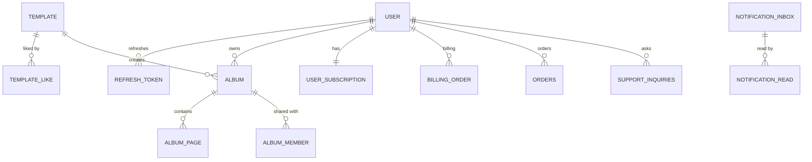
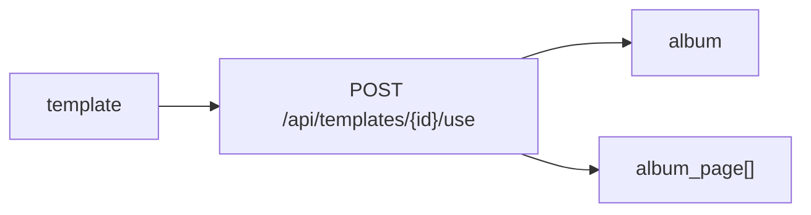
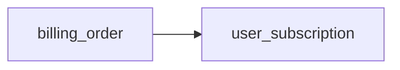
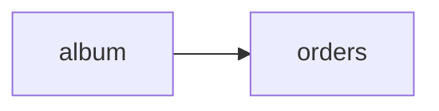
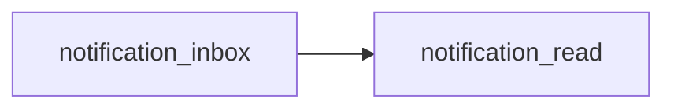

# SnapFit Application ERD

전체 애플리케이션 데이터 흐름을 도메인 단위로 빠르게 보기 위한 ERD 문서다.

관련 문서:
- [App Database Spec](./APP_DATABASE_SPEC.md)
- [App API Spec](./APP_API_SPEC.md)
- [App DB Constraints](./APP_DB_CONSTRAINTS.md)

## 1. High-Level ERD

## 2. Domain View

### 인증 / 사용자
- `user`
- `refresh_token`

### 컨텐츠
- `template`
- `template_like`
- `album`
- `album_page`
- `album_member`

### 상거래
- `user_subscription`
- `billing_order`
- `orders`

### 운영 / 커뮤니케이션
- `notification_inbox`
- `notification_read`
- `support_inquiries`

## 3. 핵심 흐름

### 템플릿 사용하기

### 구독 결제

### 실물 주문

### 알림 읽음 처리

