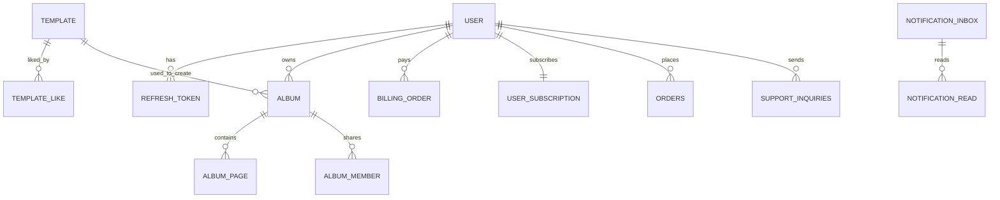

# SnapFit Application Database Spec

이 문서는 SnapFit 백엔드의 전체 애플리케이션 DB 명세서다.
템플릿만이 아니라 사용자, 인증, 앨범, 결제, 주문, 알림, 문의까지 실제 엔티티 기준으로 정리한다.

중요:

- 현재 프로젝트는 `spring.jpa.hibernate.ddl-auto=update` 를 사용한다.
- 따라서 최신 스키마 기준은 `schema.sql` 단독이 아니라 실제 JPA Entity 코드다.
- `schema.sql` 은 일부 기본 테이블 보조 역할이고, 운영 시점의 실제 구조는 엔티티가 더 정확하다.

관련 문서:

- [Template DB Spec](./TEMPLATE_DB_SPEC.md)
- [Template ERD](./TEMPLATE_ERD.md)
- [Template API Spec](./TEMPLATE_API_SPEC.md)
- [App API Spec](./APP_API_SPEC.md)
- [App DB Constraints](./APP_DB_CONSTRAINTS.md)
- [App Schema Draft](./APP_SCHEMA_DRAFT.sql)

기준 소스:

- `src/main/java/com/snapfit/snapfitbackend/domain/**/entity/*.java`
- `src/main/resources/application.yml`

## 1. 도메인 맵

SnapFit DB는 아래 도메인으로 나뉜다.

1. 인증 / 사용자
2. 앨범 / 페이지 / 협업
3. 템플릿 / 좋아요
4. 구독 / 결제
5. 주문 / 배송
6. 알림
7. 고객지원

## 2. 전역 운영 원칙

- 사용자 식별은 도메인별로 `Long id` 또는 `String userId` 두 방식이 섞여 있다.
- 앱 핵심 컨텐츠는 `album`, `album_page`, `template` 에 저장된다.
- 템플릿 사용하기는 `template.template_json` 을 읽어 `album`, `album_page` 로 복제한다.
- 결제와 주문은 분리되어 있다.
  - `billing_order`: 구독 결제
  - `orders`: 포토북/실물 주문
- 알림은 inbox/read 분리 구조다.
- 삭제보다 `active` 또는 상태값 변경을 우선하는 테이블이 있다.

## 3. 테이블 목록

### 3.1 인증 / 사용자

#### `user`

로그인 사용자 프로필 저장.

| 필드 | 타입 | 설명 |
|---|---|---|
| `id` | `BIGINT PK` | 사용자 고유 식별자 |
| `email` | `VARCHAR(255)` | 이메일 |
| `name` | `VARCHAR(255)` | 표시 이름 |
| `profile_image_url` | `VARCHAR(1000)` | 프로필 이미지 |
| `provider` | `VARCHAR(50)` | 소셜 로그인 제공자 |
| `terms_version` | `VARCHAR(50)` | 동의한 약관 버전 |
| `privacy_version` | `VARCHAR(50)` | 동의한 개인정보 처리방침 버전 |
| `marketing_opt_in` | `BOOLEAN` | 마케팅 동의 여부 |
| `consented_at` | `DATETIME` | 동의 시각 |
| `created_at` | `DATETIME` | 생성 시각 |
| `updated_at` | `DATETIME` | 수정 시각 |

#### `refresh_token`

리프레시 토큰 저장.

| 필드 | 타입 | 설명 |
|---|---|---|
| `id` | `BIGINT PK` | PK |
| `user_id` | `BIGINT` | `user.id` 참조 개념 |
| `token` | `VARCHAR UNIQUE` | refresh token |
| `expiry_date` | `DATETIME` | 만료 시각 |

주의:

- 엔티티 상 FK 제약은 없지만 개념적으로는 `user.id` 와 연결된다.

### 3.2 앨범 / 페이지 / 협업

#### `album`

사용자 앨범 헤더.

| 필드 | 타입 | 설명 |
|---|---|---|
| `id` | `BIGINT PK` | 앨범 ID |
| `user_id` | `VARCHAR(128)` | 앨범 소유자 |
| `ratio` | `VARCHAR(100)` | 비율 예: `3:4`, `1:1` |
| `title` | `VARCHAR(255)` | 앨범 제목 |
| `cover_image_url` | `VARCHAR(1000)` | 커버 이미지 |
| `cover_thumbnail_url` | `VARCHAR(1000)` | 커버 썸네일 |
| `cover_original_url` | `VARCHAR(1000)` | 커버 원본 |
| `cover_preview_url` | `VARCHAR(1000)` | 커버 미리보기 |
| `cover_layers_json` | `LONGTEXT` | 커버 레이어 JSON |
| `cover_theme` | `VARCHAR(100)` | 커버 테마 |
| `total_pages` | `INT` | 현재 페이지 수 |
| `target_pages` | `INT` | 목표 페이지 수 |
| `orders` | `INT` | 사용자 정렬용 순서 |
| `created_at` | `DATETIME` | 생성 시각 |
| `updated_at` | `DATETIME` | 수정 시각 |

#### `album_page`

앨범의 실제 각 페이지.

| 필드 | 타입 | 설명 |
|---|---|---|
| `id` | `BIGINT PK` | 페이지 ID |
| `album_id` | `BIGINT FK` | 상위 앨범 |
| `page_number` | `INT` | 페이지 번호 |
| `layers_json` | `LONGTEXT` | 레이어 구조 JSON |
| `image_url` | `VARCHAR(500)` | 하위 호환용 이미지 |
| `original_url` | `VARCHAR(1000)` | 원본 페이지 이미지 |
| `preview_url` | `VARCHAR(1000)` | 앱용 페이지 이미지 |
| `thumbnail_url` | `VARCHAR(500)` | 썸네일 |
| `created_at` | `DATETIME` | 생성 시각 |
| `updated_at` | `DATETIME` | 수정 시각 |

#### `album_member`

공동 편집/초대 구성원.

| 필드 | 타입 | 설명 |
|---|---|---|
| `id` | `BIGINT PK` | PK |
| `album_id` | `BIGINT FK` | 대상 앨범 |
| `user_id` | `VARCHAR(128)` | 초대된 사용자 |
| `role` | `VARCHAR(20)` | 역할 enum |
| `status` | `VARCHAR(20)` | 상태 enum |
| `invited_by` | `VARCHAR(128)` | 초대한 사용자 |
| `invite_token` | `VARCHAR(64) UNIQUE` | 초대 토큰 |
| `created_at` | `DATETIME` | 생성 시각 |
| `updated_at` | `DATETIME` | 수정 시각 |

### 3.3 템플릿 / 좋아요

#### `template`

템플릿 스토어 상품 원본.

| 필드 | 타입 | 설명 |
|---|---|---|
| `id` | `BIGINT PK` | 템플릿 ID |
| `title` | `VARCHAR` | 제목 |
| `sub_title` | `VARCHAR` | 보조 제목 |
| `description` | `TEXT` | 설명 |
| `cover_image_url` | `VARCHAR(1000)` | 커버 이미지 |
| `preview_images_json` | `LONGTEXT` | 미리보기 이미지 배열(JSON) |
| `page_count` | `INT` | 페이지 수 |
| `like_count` | `INT` | 좋아요 수 캐시 |
| `user_count` | `INT` | 사용 수 캐시 |
| `is_best` | `BOOLEAN` | BEST 배지 |
| `is_premium` | `BOOLEAN` | 유료 여부 |
| `category` | `VARCHAR(40)` | 카테고리 |
| `tags_json` | `LONGTEXT` | 태그 배열(JSON) |
| `weekly_score` | `INT` | 랭킹 점수 |
| `new_until` | `DATETIME` | NEW 배지 종료 시각 |
| `active` | `BOOLEAN` | 노출 여부 |
| `template_json` | `LONGTEXT` | 템플릿 구조 원본 |
| `created_at` | `DATETIME` | 생성 시각 |
| `updated_at` | `DATETIME` | 수정 시각 |

#### `template_like`

템플릿 좋아요 상태.

| 필드 | 타입 | 설명 |
|---|---|---|
| `id` | `BIGINT PK` | PK |
| `template_id` | `BIGINT` | 대상 템플릿 |
| `user_id` | `VARCHAR` | 사용자 식별자 |
| `created_at` | `DATETIME` | 좋아요 생성 시각 |

제약:

- `(template_id, user_id)` 유니크

### 3.4 구독 / 결제

#### `user_subscription`

사용자 구독 상태.

| 필드 | 타입 | 설명 |
|---|---|---|
| `user_id` | `VARCHAR(128) PK` | 구독 사용자 |
| `plan_code` | `VARCHAR(40)` | 플랜 코드 |
| `status` | `VARCHAR(20)` | 구독 상태 enum |
| `started_at` | `DATETIME` | 시작 시각 |
| `expires_at` | `DATETIME` | 만료 시각 |
| `next_billing_at` | `DATETIME` | 다음 결제 시각 |
| `last_order_id` | `VARCHAR(64)` | 마지막 결제 주문 ID |
| `created_at` | `DATETIME` | 생성 시각 |
| `updated_at` | `DATETIME` | 수정 시각 |

#### `billing_order`

구독 결제 주문.

| 필드 | 타입 | 설명 |
|---|---|---|
| `id` | `BIGINT PK` | PK |
| `order_id` | `VARCHAR(64) UNIQUE` | 외부 주문 ID |
| `user_id` | `VARCHAR(128)` | 사용자 |
| `plan_code` | `VARCHAR(40)` | 플랜 코드 |
| `provider` | `VARCHAR(32)` | 결제 제공자 |
| `status` | `VARCHAR(20)` | 결제 상태 enum |
| `amount` | `INT` | 금액 |
| `currency` | `VARCHAR(8)` | 통화 |
| `checkout_url` | `VARCHAR(1000)` | 결제 URL |
| `reserve_id` | `VARCHAR(120)` | 예약 ID |
| `transaction_id` | `VARCHAR(120)` | 거래 ID |
| `fail_reason` | `VARCHAR(600)` | 실패 사유 |
| `created_at` | `DATETIME` | 생성 시각 |
| `approved_at` | `DATETIME` | 승인 시각 |
| `updated_at` | `DATETIME` | 수정 시각 |

### 3.5 주문 / 배송

#### `orders`

실물 포토북 주문.

| 필드 | 타입 | 설명 |
|---|---|---|
| `id` | `BIGINT PK` | PK |
| `order_id` | `VARCHAR(64) UNIQUE` | 주문번호 |
| `user_id` | `VARCHAR(128)` | 주문자 |
| `title` | `VARCHAR(220)` | 주문 제목 |
| `amount` | `INT` | 결제 금액 |
| `album_id` | `BIGINT` | 원본 앨범 |
| `page_count` | `INT` | 페이지 수 |
| `recipient_name` | `VARCHAR(120)` | 수령인명 |
| `recipient_phone` | `VARCHAR(40)` | 수령인 전화 |
| `zip_code` | `VARCHAR(20)` | 우편번호 |
| `address_line1` | `VARCHAR(255)` | 기본 주소 |
| `address_line2` | `VARCHAR(255)` | 상세 주소 |
| `delivery_memo` | `VARCHAR(255)` | 배송 메모 |
| `payment_method` | `VARCHAR(40)` | 결제 방식 |
| `payment_confirmed_at` | `DATETIME` | 결제 확정 시각 |
| `print_vendor` | `VARCHAR(40)` | 인쇄 업체 |
| `print_vendor_order_id` | `VARCHAR(120)` | 인쇄 업체 주문 ID |
| `print_submitted_at` | `DATETIME` | 인쇄 접수 시각 |
| `courier` | `VARCHAR(60)` | 택배사 |
| `tracking_number` | `VARCHAR(120)` | 송장번호 |
| `shipped_at` | `DATETIME` | 출고 시각 |
| `delivered_at` | `DATETIME` | 배송완료 시각 |
| `status` | `VARCHAR(30)` | 주문 상태 enum |
| `progress` | `DOUBLE` | 진행률 |
| `created_at` | `DATETIME` | 생성 시각 |
| `updated_at` | `DATETIME` | 수정 시각 |

### 3.6 알림

#### `notification_inbox`

알림 원본 메시지.

| 필드 | 타입 | 설명 |
|---|---|---|
| `id` | `BIGINT PK` | 알림 ID |
| `type` | `VARCHAR(60)` | 알림 타입 |
| `title` | `VARCHAR(160)` | 제목 |
| `body` | `VARCHAR(600)` | 본문 |
| `target_topic` | `VARCHAR(255)` | 토픽 대상 |
| `deeplink` | `VARCHAR(500)` | 앱 딥링크 |
| `payload_json` | `LONGTEXT` | 추가 payload |
| `created_at` | `DATETIME` | 생성 시각 |

#### `notification_read`

사용자 읽음 상태.

| 필드 | 타입 | 설명 |
|---|---|---|
| `id` | `BIGINT PK` | PK |
| `notification_id` | `BIGINT` | 원본 알림 |
| `user_id` | `VARCHAR(128)` | 읽은 사용자 |
| `read_at` | `DATETIME` | 읽은 시각 |

제약:

- `(notification_id, user_id)` 유니크

### 3.7 고객지원

#### `support_inquiries`

1:1 문의.

| 필드 | 타입 | 설명 |
|---|---|---|
| `id` | `BIGINT PK` | 문의 ID |
| `user_id` | `VARCHAR(128)` | 문의 사용자 |
| `category` | `VARCHAR(80)` | 문의 카테고리 |
| `subject` | `VARCHAR(160)` | 제목 |
| `message` | `VARCHAR(2000)` | 문의 내용 |
| `status` | `VARCHAR(20)` | 문의 상태 enum |
| `resolved_at` | `DATETIME` | 해결 시각 |
| `resolved_by` | `VARCHAR(120)` | 처리자 |
| `created_at` | `DATETIME` | 생성 시각 |
| `updated_at` | `DATETIME` | 수정 시각 |

## 4. 핵심 관계

주의:

- DB FK가 없는 관계도 일부는 서비스 로직상 연결되어 있다.
- 예: `album.user_id`, `orders.user_id`, `template_like.user_id`

## 5. 서비스 흐름별 테이블 사용

### 5.1 로그인

- `user`
- `refresh_token`

### 5.2 템플릿 스토어

- `template`
- `template_like`

### 5.3 템플릿 사용하기

- 읽기: `template`
- 쓰기: `album`, `album_page`
- 후처리: `template.user_count` 증가

### 5.4 앨범 협업

- `album`
- `album_member`

### 5.5 구독 결제

- `billing_order`
- `user_subscription`

### 5.6 실물 주문

- `orders`
- 연결 컨텐츠: `album`

### 5.7 알림

- `notification_inbox`
- `notification_read`

### 5.8 고객지원

- `support_inquiries`

## 6. 운영상 중요한 컬럼

| 테이블 | 컬럼 | 이유 |
|---|---|---|
| `template` | `active` | 스토어 노출 on/off |
| `template` | `weekly_score` | 홈/스토어 정렬 핵심 |
| `template` | `template_json` | 실제 생성 원본 |
| `album` | `ratio` | 비율 복원 |
| `album_page` | `layers_json` | 페이지 원본 |
| `orders` | `status` | 제작/배송 상태 추적 |
| `user_subscription` | `status` | premium 사용 가능 여부 |
| `notification_read` | `(notification_id, user_id)` | 읽음 상태 기준 |

## 7. 주의사항

### 7.1 `schema.sql` 은 부분 명세

- `schema.sql` 에 없는 테이블도 JPA update로 생성될 수 있다.
- 전체 구조 파악은 Entity 우선.

### 7.2 `user_id` 타입 혼재

- `user.id` 는 `Long`
- 다른 도메인 다수는 `String userId`
- 통합 명세를 볼 때 이 차이를 항상 의식해야 함

### 7.3 템플릿 JSON은 데이터이자 로직 원본

- `template.template_json` 은 단순 설명 필드가 아니라 실제 생성 구조
- DB 백업/복원/배포 시 중요도 높음

## 8. 추천 후속 작업

1. `user.id` 와 각 도메인의 `user_id` 타입 정합성 정리
2. 전체 앱 ERD를 관리자/운영용과 개발용 두 버전으로 분리
3. FK가 없는 논리 관계에 대해 서비스 레벨 명세 추가
4. 마이그레이션 도구(Flyway/Liquibase) 도입 검토
