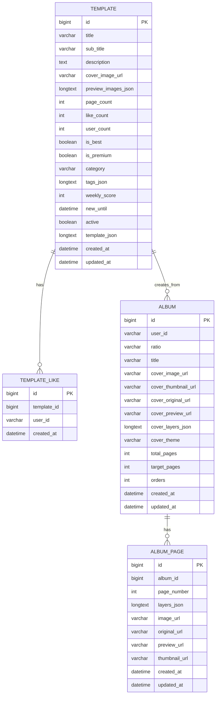

# SnapFit Template DB Spec

이 문서는 SnapFit 템플릿 기능과 직접 연결되는 백엔드 DB 구조를 정리한 명세서다.
목표는 아래 세 가지다.

- 템플릿 운영 시 어떤 테이블과 필드를 만지는지 빠르게 파악
- 앱/백엔드/템플릿 제작 파이프라인이 같은 필드명을 기준으로 대화
- 새 템플릿 등록, 삭제, 비활성화, 앨범 생성 시 영향 범위를 명확히 확인

기준 소스:

- `src/main/java/com/snapfit/snapfitbackend/domain/template/entity/TemplateEntity.java`
- `src/main/java/com/snapfit/snapfitbackend/domain/template/entity/TemplateLikeEntity.java`
- `src/main/java/com/snapfit/snapfitbackend/domain/album/entity/AlbumEntity.java`
- `src/main/java/com/snapfit/snapfitbackend/domain/album/entity/AlbumPageEntity.java`
- `src/main/java/com/snapfit/snapfitbackend/domain/template/service/TemplateService.java`
- `src/main/java/com/snapfit/snapfitbackend/controller/TemplateController.java`
- `src/main/java/com/snapfit/snapfitbackend/controller/AdminWebController.java`
- [Template ERD](./TEMPLATE_ERD.md)
- [Template API Spec](./TEMPLATE_API_SPEC.md)

## 1. 운영 원칙

- 템플릿의 단일 운영 원본은 DB `template` 테이블이다.
- 앱 스토어/상세/추천은 서버 응답을 기준으로 동작해야 한다.
- 템플릿 좋아요는 `template_like` 테이블로 관리하고, 카운트 캐시는 `template.like_count`에 저장한다.
- 템플릿 사용하기는 `template.template_json`을 읽어 `album`, `album_page`로 복제한다.
- 활성 템플릿만 스토어에 노출한다.

## 2. ER 개요

## 3. 테이블별 명세

### 3.1 `template`

템플릿 스토어의 실제 상품 데이터.

주요 역할:

- 스토어 목록/상세 응답 원본
- 추천/랭킹/배지 계산 원본
- 템플릿 사용하기 시 앨범 생성 원본

필드:

| 필드 | 타입 | 의미 | 사용처 |
|---|---|---|---|
| `id` | `BIGINT` | 템플릿 PK | 상세 조회, 좋아요, 사용하기, 관리자 삭제 |
| `title` | `VARCHAR` | 스토어 제목 | 목록/상세/UI 표시, 중복 식별 |
| `sub_title` | `VARCHAR` | 보조 설명 | 상세/스토어 보조 카피 |
| `description` | `TEXT` | 상세 설명 | 템플릿 상세 |
| `cover_image_url` | `VARCHAR(1000)` | 대표 커버 이미지 | 스토어 카드, 상세 커버, 앨범 생성 초기 커버 참조 |
| `preview_images_json` | `LONGTEXT` | 페이지 미리보기 이미지 배열(JSON 문자열) | 상세 페이지 썸네일, 운영 검수 |
| `page_count` | `INT` | 총 페이지 수 | 상세/생성 로직/검증 |
| `like_count` | `INT` | 좋아요 수 캐시 | 목록 정렬, 상세, 좋아요 토글 |
| `user_count` | `INT` | 사용 횟수 캐시 | 정렬/운영 지표 |
| `is_best` | `BOOLEAN` | BEST 배지 여부 | 스토어 배지 |
| `is_premium` | `BOOLEAN` | 유료 템플릿 여부 | 구독 체크 후 사용 가능 여부 |
| `category` | `VARCHAR(40)` | 카테고리 | 필터/운영 분류 |
| `tags_json` | `LONGTEXT` | 태그 배열(JSON 문자열) | 스토어 태그, 검색/운영 |
| `weekly_score` | `INT` | 랭킹 점수 | summary/list 정렬 |
| `new_until` | `DATETIME` | NEW 배지 만료 시각 | 상세/요약 응답의 `isNew` 계산 |
| `active` | `BOOLEAN` | 노출 여부 | 스토어 노출 필터 |
| `template_json` | `LONGTEXT` | 템플릿 원본 JSON | 상세, 앨범 생성, 페이지/레이어 복원 |
| `created_at` | `DATETIME` | 생성 시각 | 정렬/운영 |
| `updated_at` | `DATETIME` | 수정 시각 | 관리자 화면, 최신 반영 확인 |

중요 규칙:

- `active = false` 이면 스토어 노출 금지
- `template_json` 은 필수
- `cover_image_url` 은 필수
- `preview_images_json`, `tags_json` 은 JSON array 문자열이어야 함
- `page_count` 는 `template_json.pages.length` 와 일치하는 것이 이상적

### 3.2 `template_like`

템플릿 좋아요 상태 저장 테이블.

필드:

| 필드 | 타입 | 의미 |
|---|---|---|
| `id` | `BIGINT` | PK |
| `template_id` | `BIGINT` | 좋아요 대상 템플릿 |
| `user_id` | `VARCHAR` | 사용자 식별자 |
| `created_at` | `DATETIME` | 좋아요 생성 시각 |

제약:

- `(template_id, user_id)` 유니크

운영 규칙:

- 실제 좋아요 상태는 이 테이블이 원본
- `template.like_count` 는 캐시이므로 토글 시 같이 증감해야 함
- 템플릿 삭제 시 `template_like` 도 같이 삭제

### 3.3 `album`

템플릿 사용하기 시 생성되는 사용자 앨범 헤더.

템플릿과 직접 연결되는 핵심 필드:

| 필드 | 타입 | 의미 |
|---|---|---|
| `user_id` | `VARCHAR` | 앨범 소유자 |
| `ratio` | `VARCHAR` | 커버/페이지 비율 |
| `title` | `VARCHAR` | 기본적으로 템플릿 제목에서 시작 |
| `cover_image_url` | `VARCHAR(1000)` | 생성 시 초기 커버 이미지 |
| `cover_thumbnail_url` | `VARCHAR(1000)` | 커버 썸네일 |
| `cover_original_url` | `VARCHAR(1000)` | 원본 커버 |
| `cover_preview_url` | `VARCHAR(1000)` | 앱용 커버 |
| `cover_layers_json` | `LONGTEXT` | 커버 레이어 원본 |
| `cover_theme` | `VARCHAR(100)` | 커버 테마 |
| `total_pages` | `INT` | 저장된 페이지 수 |
| `target_pages` | `INT` | 목표 페이지 수 |

### 3.4 `album_page`

템플릿 JSON의 각 페이지가 복제되는 실제 사용자 페이지.

| 필드 | 타입 | 의미 |
|---|---|---|
| `album_id` | `BIGINT` | 상위 앨범 FK |
| `page_number` | `INT` | 페이지 번호 |
| `layers_json` | `LONGTEXT` | 레이어 JSON |
| `image_url` | `VARCHAR(500)` | 하위 호환용 페이지 이미지 |
| `original_url` | `VARCHAR(1000)` | 원본 페이지 이미지 |
| `preview_url` | `VARCHAR(1000)` | 앱용 페이지 이미지 |
| `thumbnail_url` | `VARCHAR(500)` | 썸네일 |

## 4. 실제 동작 흐름

### 4.1 스토어 목록

- API: `GET /api/templates`
- API: `GET /api/templates/summary?page=&size=`
- 조건: `active = true OR active IS NULL`
- 정렬:
  1. `weekly_score DESC`
  2. `like_count DESC`
  3. `user_count DESC`
  4. `created_at DESC`
  5. `id DESC`

### 4.2 템플릿 상세

- API: `GET /api/templates/{id}`
- 응답은 `TemplateResponse`
- 포함 항목:
  - 제목/설명/배지
  - `coverImageUrl`
  - `previewImages`
  - `templateJson`

### 4.3 좋아요 토글

- API: `POST /api/templates/{id}/like?userId=...`
- 동작:
  - 있으면 `template_like` 삭제 + `template.like_count - 1`
  - 없으면 `template_like` 생성 + `template.like_count + 1`

### 4.4 템플릿 사용하기

- API: `POST /api/templates/{id}/use?userId=...`
- 흐름:
  1. `template` 조회
  2. `active` 확인
  3. `is_premium` 이면 구독 여부 확인
  4. `template_json` 파싱
  5. `album` 생성
  6. `pages[]` 를 `album_page` 로 저장
  7. `template.user_count + 1`

중요:

- 커버는 현재 `template.cover_image_url` 을 `album` 의 여러 cover URL 필드에 동일하게 복제
- 페이지는 `template_json.pages[].layers` 가 그대로 `album_page.layers_json` 으로 저장됨

## 5. 관리자 API

### 5.1 업서트

- `POST /api/templates/admin/upsert`
- 대체 경로: `POST /api/admin/templates/upsert`

용도:

- 새 템플릿 등록
- 기존 템플릿 수정

필수 입력:

- `title`
- `coverImageUrl`
- `pageCount`
- `templateJson`

검증:

- `templateJson.cover.layers` must be array
- `templateJson.pages` must be array
- `previewImagesJson`, `tagsJson` 는 JSON array 문자열이어야 함

### 5.2 활성/비활성

- `POST /api/templates/admin/{id}/active`
- 대체 경로: `POST /api/admin/templates/{id}/active`

용도:

- DB는 유지하되 스토어 노출만 끄기

### 5.3 삭제

- `DELETE /api/admin/templates/{id}`

현재 확인된 동작:

- 템플릿 row 삭제
- 연결된 `template_like` row 삭제
- 응답 예시: `{ "id": 38, "deleted": true, "deletedLikes": 1 }`

권장 운영:

- 일반 비노출은 `active=false`
- 완전 제거가 필요할 때만 `DELETE`

## 6. 운영 시 주의사항

### 6.1 `schema.sql` 과 실제 테이블의 차이

- 현재 프로젝트는 `spring.jpa.hibernate.ddl-auto=update`
- 즉 일부 테이블은 엔티티 기준으로 런타임에 생성/갱신됨
- `src/main/resources/schema.sql` 만 보고 전체 스키마를 판단하면 안 됨
- 템플릿 관련 최신 스키마 기준은 `TemplateEntity`, `TemplateLikeEntity` 가 우선

### 6.2 템플릿 JSON은 단순 부가 데이터가 아님

- `template_json` 은 실제 생성 로직의 원본
- 커버/페이지/레이어 구조가 전부 이 필드에 들어감
- 템플릿 QA에서 가장 중요한 컬럼

### 6.3 운영 배지 계산

- `isBest`: 수동 배지
- `newUntil`: 시점 기반 `isNew` 계산
- `weeklyScore`, `likeCount`, `userCount`: 요약 정렬에 사용

## 7. 템플릿 운영 체크리스트

- 새 템플릿 등록 전 `templateJson` 필수 구조 확인
- `coverImageUrl` 와 `previewImagesJson[0]` 일치 확인
- `active=true` 인지 확인
- 삭제 전 실제 노출/사용 중인지 확인
- 템플릿 삭제 시 좋아요 row 정리 여부 확인
- `template_json` 과 앱 렌더 결과가 일치하는지 확인

## 8. 추천 개선 사항

- `template` 테이블에 `template_code` 또는 `template_id` 컬럼을 별도 추가
  - 현재는 앱 JSON 내부 `templateId` 와 DB row가 분리되어 있음
- `preview_images_json`, `tags_json` 을 장기적으로는 정규화 또는 JSON 컬럼 전환 검토
- 템플릿 등록/삭제/활성변경 감사 로그 테이블 추가 검토
- `template_json` schema version 을 DB 레벨 컬럼으로 승격 검토
