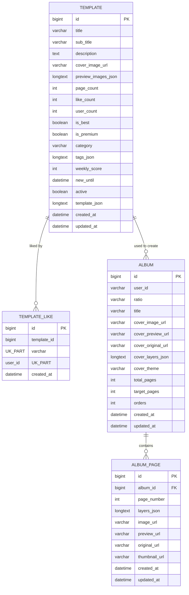
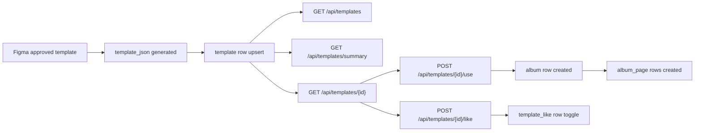

# SnapFit Template ERD

템플릿 운영에서 실제로 자주 보는 테이블 관계만 따로 정리한 문서다.

관련 문서:
- [Template DB Spec](./TEMPLATE_DB_SPEC.md)
- [Template Operations Guide](./TEMPLATE_OPERATIONS.md)

## 1. 핵심 관계

## 2. 테이블 역할 요약

### `template`
- 스토어 상품 원본
- 커버/미리보기/배지/정렬/활성 상태 보관
- 실제 레이아웃 원본은 `template_json`

### `template_like`
- 사용자별 좋아요 상태 원본
- `(template_id, user_id)` 유니크
- `template.like_count` 는 캐시

### `album`
- 템플릿 사용하기 시 생성되는 앨범 헤더
- 템플릿 커버가 여기로 복제됨

### `album_page`
- `template_json.pages[]` 가 실제 사용자 페이지로 저장된 결과

## 3. 데이터 흐름

## 4. 운영 시 가장 중요한 컬럼

| 테이블 | 컬럼 | 이유 |
|---|---|---|
| `template` | `active` | 스토어 노출 on/off 기준 |
| `template` | `cover_image_url` | 카드/상세 대표 이미지 |
| `template` | `preview_images_json` | 페이지 미리보기 원본 |
| `template` | `template_json` | 실제 생성 로직의 원본 |
| `template` | `weekly_score` | summary/list 정렬 핵심 |
| `template` | `new_until` | NEW 배지 계산 |
| `album` | `ratio` | 세로/정사각/가로 비율 복원 |
| `album_page` | `layers_json` | 페이지 레이아웃 원본 |

## 5. 운영 포인트

- 템플릿 삭제는 `template_like` 정리까지 같이 일어난다.
- 템플릿 비노출만 원하면 `active=false` 가 우선이다.
- 템플릿 변경 영향은 `template` 뿐 아니라 생성 이후 `album`, `album_page` 결과까지 같이 봐야 한다.
